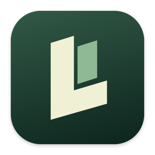
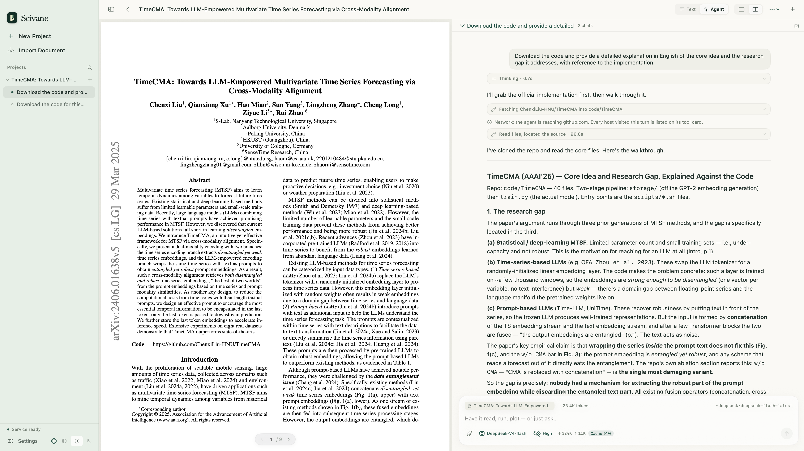

<div align="center">

[English](README.md)

<h1>&nbsp;&nbsp;Scivane</h1>

**你的 AI 论文阅读智能体**

[](#开始使用)
[](#开始使用)
[](#开始使用)
[](LICENSE)


</div>

---

## Scivane：

你的 AI 论文阅读智能体。Scivane 以论文为中心，将文献阅读、AI 交互与研究工具整合于一体，让阅读与思考始终围绕原文展开。Agent 不仅能够结合论文上下文进行深入分析，还能自主检索相关文献、获取开源代码并辅助理解，让每一篇论文都成为可以持续探索的独立研究项目。



---

## 开始使用

需要 Apple 芯片的 Mac，以及 Xcode 命令行工具（用来编译）。

```bash
git clone https://github.com/akatsuky999/Scivane-macos.git
cd Scivane-macos
make app
```

---

## 上手指南

Scivane 不提供安装包，需要在自己的 Mac 上编译一次。你需要一台 Apple 芯片的 Mac（M1 及更新）、macOS 14 或更新，以及能访问 GitHub 的网络。

### 1 · 安装命令行工具

打开「终端」，运行下面这条命令，在弹窗里点「安装」。只需要命令行工具，不用装完整的 Xcode。

```bash
xcode-select --install
```

### 2 · 编译

```bash
git clone https://github.com/akatsuky999/Scivane-macos.git
cd Scivane-macos
make app
```

看到 `完成 → …/Desktop/Scivane.app` 就成功了，App 在桌面上。

### 3 · 填 API key

打开 Scivane，按 <kbd>⌘</kbd> <kbd>,</kbd> 进入设置 →「模型」。App 预置了 OpenRouter、DeepSeek、OpenAI 三张卡：点开一张，粘贴 API key，点「保存 key」和「测试连接」，再点卡片左侧的圆点设为默认。

用 Claude 或 Gemini：点「＋ 新建卡片」→「自定义」，协议选 Anthropic 或 Google Gemini，接入地址分别填 `https://api.anthropic.com` 和 `https://generativelanguage.googleapis.com`。

### 4 · 本地 OCR（可选）

只有把 PDF 识别成 Markdown 时才需要。第一次点「开始 OCR」时按提示安装即可，下载约 2.2 GB。

### 更新

退出 Scivane 后运行：

```bash
cd ~/Scivane-macos && git pull && make app
```

### 常见问题

- **下载慢或网络报错**：终端需要能访问 GitHub 和 PyPI。用代理的话，先运行 `export https_proxy=http://127.0.0.1:端口`，再重新 `make app`。
- **报错提到 `Swift tools version 6.0`**：命令行工具太旧，到「系统设置 → 通用 → 软件更新」里更新。
- **提示「请先退出 Scivane 再打包」**：按 <kbd>⌘</kbd> <kbd>Q</kbd> 退出 App 后再试。

---

## 许可证

Scivane 以 [GNU AGPL-3.0](LICENSE) 发布。阅读 PDF 用的是 PyMuPDF，它以 AGPL-3.0 提供，所以本程序也用这一许可。
